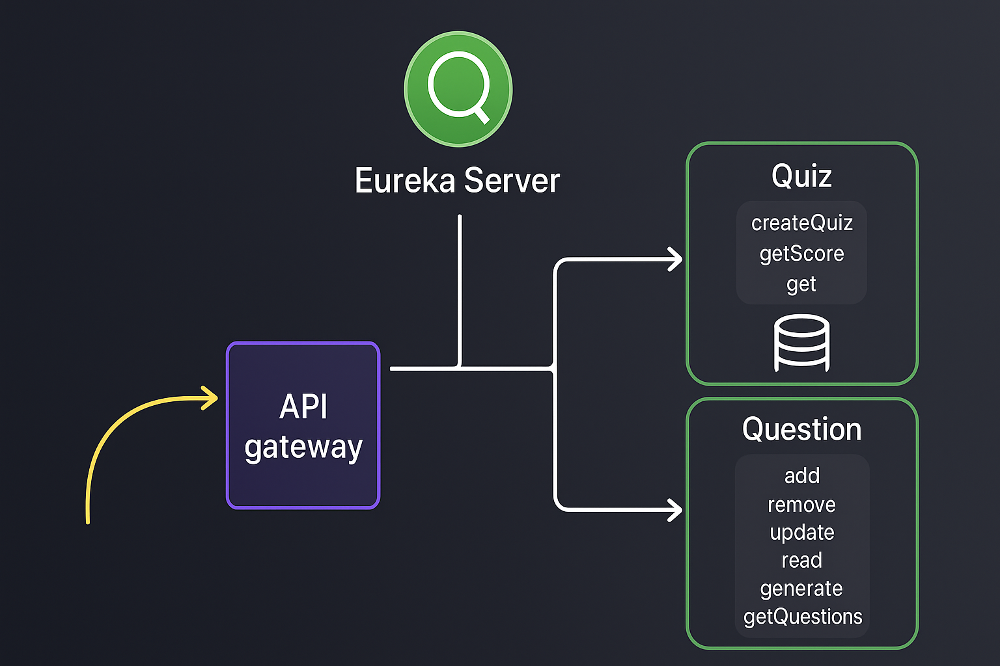

#  Quiz Application (Microservices Architecture)

This project is a **Quiz Application** built using a **Microservices architecture** with **Spring Boot**, **Spring MVC**, **Spring Data JPA**, **Hibernate**, **Oracle SQL**, **Eureka Server**, **Feign Client**, and **API Gateway**.  
It is a restructured version of the previously built **monolithic Quiz App**.

---

##  Project Overview

The application allows users to:
- View questions by category
- Create and manage quizzes
- Fetch and evaluate quiz results

It demonstrates the transition from a **Monolithic** to a **Microservices-based** architecture.

---

##  System Architecture

Below diagram shows the high-level interaction between services in the Quiz Application:



**Flow:**
1. User interacts via API Gateway.
2. Gateway routes requests to backend services.
3. Eureka Server manages service discovery.
4. Quiz Service uses Feign Client to communicate with Question Service.

---

## 🏗️ Architecture Overview

```plaintext
Client (React/Angular) 
     ↓
API Gateway (Spring Cloud Gateway)
     ↓
+----------------------+
|  Eureka Server       |
|  (Service Registry)  |
+----------------------+
     ↓
+----------------------+     +----------------------+
|  Question Service    | ⇄   |  Quiz Service        |
|  (JPA + Oracle SQL)  |     |  (Feign Client)      |
+----------------------+     +----------------------+
```

---

## ⚙️ Microservices Breakdown

### 🧩 1. Eureka Server
- Service discovery and registration.
- URL: `http://localhost:8761`

### 🧩 2. API Gateway
- Routes requests to backend services.
- Example route:
  ```
  /question/** → question-service
  /quiz/** → quiz-service
  ```

### 🧩 3. Question Service
- Manages question CRUD operations.
- Tech stack: Spring Boot, Spring JPA, Hibernate, Oracle SQL.
- Example endpoint:
  ```
  GET /question/category/{category}
  ```

### 🧩 4. Quiz Service
- Communicates with Question Service using **Feign Client**.
- Generates quizzes and evaluates results.
- Example endpoints:
  ```
  POST /quiz/create
  GET /quiz/get/{id}
  POST /quiz/submit
  ```

---

## 🛠️ Tech Stack

| Layer | Technology |
|-------|-------------|
| Backend | Spring Boot, Spring MVC, Spring Data JPA |
| Database | Oracle SQL |
| Service Discovery | Netflix Eureka |
| API Communication | OpenFeign |
| Gateway | Spring Cloud API Gateway |
| ORM | Hibernate |
| Build Tool | Maven |
| IDE | VS Code / IntelliJ IDEA |
| Version Control | Git + GitHub |

---

## ⚡ How to Run

### Prerequisites
- Java 17+
- Maven
- Oracle Database (configured in `application.properties`)
- VS Code or IntelliJ
- Postman (optional)

### Steps
1. **Start Eureka Server**
   ```bash
   mvn spring-boot:run
   ```
   or run `EurekaServerApplication.java`.

2. **Start API Gateway**

3. **Start Question and Quiz Services**
   - Ensure database connection is configured properly.
   - Example `application.properties` for Question Service:
     ```properties
     spring.datasource.url=jdbc:oracle:thin:@localhost:1521:xe
     spring.datasource.username=system
     spring.datasource.password=admin
     spring.jpa.hibernate.ddl-auto=update
     ```

4. **Access the app**
   - Eureka Dashboard → [http://localhost:8761](http://localhost:8761)
   - Question Service → [http://localhost:8080](http://localhost:8080)
   - Quiz Service → [http://localhost:8081](http://localhost:8081)
   - API Gateway → [http://localhost:8765](http://localhost:8765)

---

## 🧪 Sample Endpoints

**Create a Quiz**
```
POST http://localhost:8081/quiz/create?category=java&numQ=5
```

**Get a Quiz**
```
GET http://localhost:8081/quiz/get/{id}
```

**Submit Quiz**
```
POST http://localhost:8081/quiz/submit/{id}
```

---

## 🧰 Future Enhancements
- Add Authentication (Spring Security + JWT)
- Integrate React/Angular frontend
- Add Docker + Kubernetes deployment
- Implement centralized configuration (Spring Cloud Config)

---

## 👨‍💻 Author
**Karthik Veerla**  
📧 karthikveerla28@gmail.com  
💼 https://www.linkedin.com/in/karthikveerla/

---


